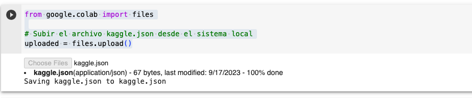

# Proyecto de Análisis de Datos

## Elaborado por:

Laura Victoria Ramos Agudelo, CC 1017156571, Ingeniería de Sistemas

## Objetivo del Proyecto

El objetivo principal de este proyecto es realizar un análisis de datos exhaustivo para obtener información valiosa y tomar decisiones informadas basadas en evidencia. Este análisis se centrará en investigar tendencias y patrones en el mercado de alquiler de bienes raíces en los Países Bajos. El modelo debe predecir el alquiler de una casa a partir de sus características.

## Descripción del Proyecto

Este proyecto de análisis de datos tiene como finalidad:

- Predecir los precios de alquiler de propiedades en función de diversas variables.
- Utilizaremos datos de alquiler de propiedades recopilados de la información disponible en https://kamernet.nl/ para cada propiedad. Este Dataset tiene más de 46,000 datos desde el 14 de julio de 2019 hasta el 3 de marzo de 2020
- Usaremos Python y bibliotecas como Pandas, NumPy y Scikit-Learn para el análisis de datos.

## Reproducción notebook

- El proyecto se entregará en un solo notebook.
- Para poder conectarte a la base de datos de Kaggle debes tener un archivo kaggle.json, esto lo obtienes de la siguiente manera

  1. Ve a tu cuenta, desplázate hasta la sección de API y haz clic en "Expirar API Token" para eliminar tokens anteriores.
  2. Haz clic en "Crear un nuevo token de API" - Se descargará un archivo kaggle.json en tu máquina.

  ### Subir el archivo kaggle.json desde el sistema local

- Una vez entres al notebook el segundo bloque de código que debes reproducir es:

```
from google.colab import files
uploaded = files.upload()
```

En este paso debes subir el kaggle.json desde tu computadora



## Video Segunda Entrega

https://www.youtube.com/watch?v=eOgTyFBzRFE&ab_channel=LauraRamos
